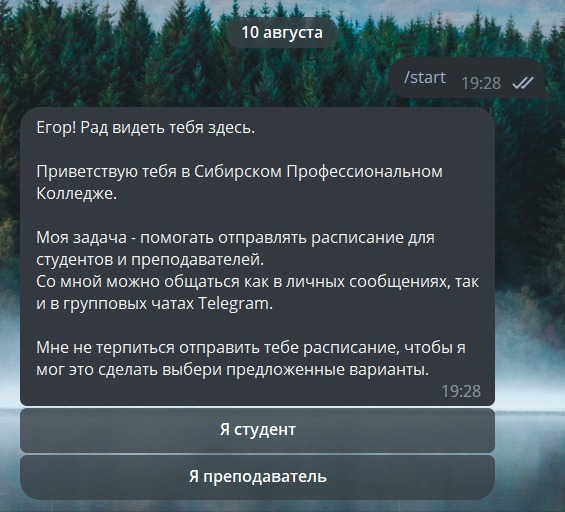

### Обновленное приведствие 

В этом обновлении вас бот будет иметь другое приведствие.

<figure markdown>
  {width=600}
    
Обновленное приведствие

</figure> 

### Преподаватели

С этого обновления бот научился понимать расписание преподавателей, а это значит что теперь и преподаватели могут пользоваться ботом.

Для работы с ботом в состоянии `teacher` необходимо выбрать кнопку `Я преподаватель`, ввести фамилию, 
и вы получите последнее возвожное обновление расписания для себя.

!!! info "Важное примечание"

    На момент описания обновления расписание могут получать только преподаватели 1 корпуса.
    
    Если по какой-то причине вы преподаватель 1 корпуса и вашего расписания нет обратитесь по ссылке - 
    [Обратная связь](https://t.me/latushko1)
