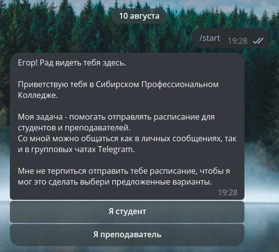

### Обновление `v5.0.3b1`: Обновленное приветствие

В рамках данного обновления было внесено изменение в приветственное сообщение бота.

<figure markdown>
  {width=600}
    
Обновленное приведствие

</figure> 

### Обновление `v5.0.3b1`: Расписание для преподавателей

В рамках обновления`v5.0.3b1`, бот может анализировать документы с названием `кабинеты(1)`, что означает:
_преподователи 1 корпуса имеют возможность получать обновление расписания_.

Для получания обновления расписания вам необходимо:

* Выполните команду `/start`
* Выберите `Я преподаватель`
* Напишите свою фамилию
* Получите последнее из возможных расписаний

!!! info "**Важное замечание**"

    На момент цикла обновлеия `v5.0.3b1` функцию получения расписания могут использовать исключительно преподаватели 
    1-го корпуса.
    
    Если вы являетесь преподавателем 1-го корпуса и по какой-либо причине не можете получить доступ к своему расписанию, 
    пожалуйста, обратитесь по следующей ссылке - [Обратная связь](https://t.me/latushko1)

