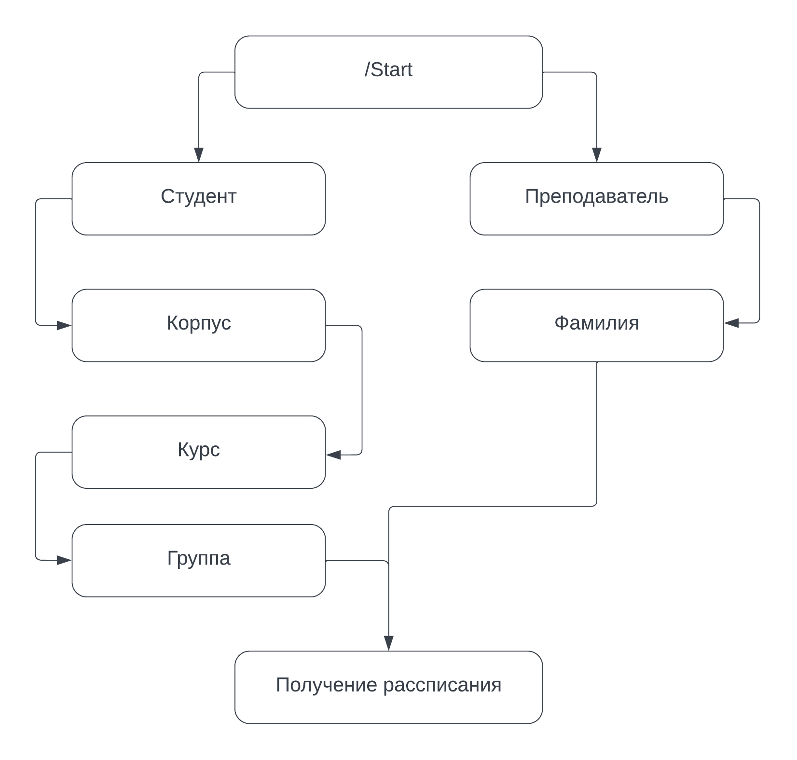

# 🤯 Тот самый бот СПК который умеет отправлять расписание

!!! danger "Внимание бот находится в разработке!"

    Пожалуйста, обратите внимание, что бот все еще находится в процессе разработки и тестирования. 

    Если у вас возникли вопросы или вы не получили расписание, 
    не стесняйтесь обратиться по ссылке - 
    [Обратная связь](https://t.me/latushko1)

> Прощайте, неудобные загрузки и просмотры Excel файлов - теперь бот сделает всё за вас

### 🙋 Личное использование

Для начала работы с ботом перейдите по ссылке [SpkScheduleBot](https://t.me/spk55ScheduleBot) и введите команду `/start`
<figure markdown>
  
  <figcaption>Команда /start</figcaption>
</figure> 

1. Откройте чат с ботом в Telegram: [SpkScheduleBot](https://t.me/spk55ScheduleBot).
2. Отправьте команду /start, чтобы активировать бота.
3. Бот вас приветствует и предложит выбрать нужный корпус для обновлений расписания. 
4. Вам потребуется предоставить некоторые базовые данные для регистрации, например, корпус, курс и номер группы.

Вот как это будет происходить.

<figure markdown>

</figure> 

Также бот может быть использован в чатах.

Будущие обновления и новости о процессе разработки будут доступны здесь, вы можете использовать навигацию для перемещения.